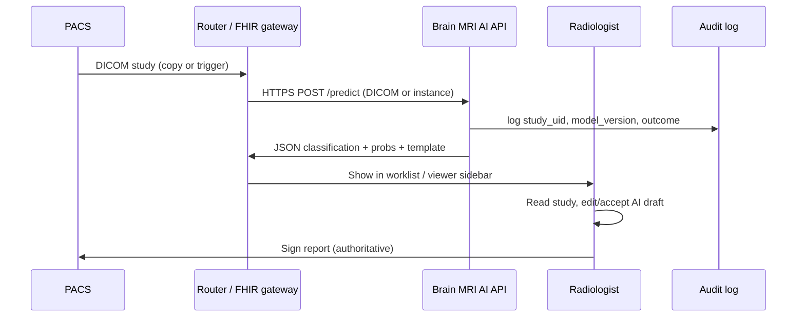

# Clinical workflow (build target)

This document defines the **radiology / neuro-oncology workflow** we are building toward—not the research demo alone. It aligns with `docs/roadmap-research-to-hospital-grade.md`, `docs/intelligence-market-regulatory-gtm.md`, and **§9** in `docs/workflows-and-features.md`.

**Regulatory note:** Until a device is cleared and contracts (BAA, DUA) are in place, treat all steps as **research / quality improvement / shadow-mode** unless your counsel says otherwise.

---

## 1. Actors and systems

| Actor / system | Role |
|----------------|------|
| **PACS / VNA** | Source of truth for DICOM studies; stores images and often prior studies. |
| **RIS / worklist** | Schedules reads; may trigger AI (future: IHE AIW-I). |
| **Radiologist / neuro** | Primary reader; signs the report; responsible for diagnosis. |
| **AI service** (this product) | Ingest DICOM or routed copies; run model(s); return **structured results** + optional draft text; **never** replaces the signed report without policy + clearance. |
| **Audit / logging** | Who ran inference, on which study, model version, outputs, edits, export. |
| **EMR** | May receive structured findings or links (future: FHIR, HL7). |

---

## 2. Phased workflows (what to build)

### Phase A — **Research / design partner (today → 6 mo)**

*Matches T8, T9, deployed API.*

1. **Data leaves site only under IRB + DUA** (or stays on-site in VPC).
2. Site exports **de-identified DICOM** or runs inference **on-prem / in partner VPC**.
3. **AI service:** `POST /predict` or `POST /report` with DICOM or image → JSON (class, probabilities, optional template report).
4. **Radiologist / fellow** reviews outputs **offline** or in a simple UI; fills feedback form (error type, agree/disagree).
5. **Metrics:** per-site validation report, confusion matrix, calibration; **patient-level** splits when metadata exists.

**Built in repo today:** DICOM slice ingestion, REST API, Streamlit demo, structured template report, audit JSONL, evaluation scripts.

**Gaps to close:** stable cloud URL (see `docs/deploy-cloud.md`), auth on API, explicit **case ID / study UID** in requests and audit logs.

---

### Phase B — **Shadow mode (no clinical decision)**

*Matches roadmap “shadow deployment”; no AI in the official read.*

1. PACS or router sends **copy** of study to AI (or batch nightly).
2. AI runs **before or in parallel** with human read; results stored in **research DB** or sidecar only.
3. Human report is created **without** relying on AI for the official diagnosis.
4. Compare AI vs final report for research (agreement, time saved in future).

**Build:** queue consumer (webhook or poll), store `{study_uid, ai_output, model_version, timestamp}`, dashboard for comparison—not replacing PACS viewer initially.

---

### Phase C — **Assistive / pre-read (policy + often clearance)**

1. Worklist or viewer shows **AI suggestion** (e.g. triage flag, draft bullets) with **prominent disclaimer**.
2. Radiologist **accepts, edits, or dismisses**; all actions logged.
3. Output can flow to **structured report fields** (template-first; LLM only if grounded).

**Build:** authenticated session, role (resident vs attending), **human-in-the-loop** state machine (pending → accepted → edited → signed).

---

### Phase D — **Integrated (PACS/RIS, IHE, DICOM SEG/SR)**

*Matches T14, hospital-grade roadmap.*

1. **DICOM** study in; **DICOM SR / FHIR** or vendor API out with measurements when segmentation exists.
2. **IHE AI Results (AIR)** / **AIW-I** for request/response patterns where applicable.
3. **DICOM SEG** when you ship segmentation.

**Build:** integration with one vendor or GCP Healthcare API / AWS HealthLake in a **staging** environment; not required for first academic partner.

---

## 3. End-to-end flow (target state, diagram)

---

## 4. What we implement next (engineering backlog)

| Priority | Item | Status | Maps to |
|----------|------|--------|--------|
| P1 | **API auth** (`X-API-Key` when `API_KEY` / `API_KEYS` set) + **rate limits** (slowapi) on `/predict`, `/report`, `/clinical/feedback` | **Done** | T6, T9 |
| P2 | **Request metadata:** `study_instance_uid`, `site_id`, `shadow_mode` as multipart form fields; echoed in JSON; **audit** events `api_predict` / `api_report` | **Done** | Clinical traceability |
| P3 | **Clinical Streamlit page** `src/app/pages/2_Clinical_workflow.py`: DICOM or image → inference + structured findings + **feedback** (agree / wrong class / unclear) | **Done** | T9 feedback |
| P4 | **Shadow store:** `logs/shadow_results.jsonl`; **feedback:** `logs/clinical_feedback.jsonl` (gitignored `logs/`) | **Done** | Phase B |
| P5 | **Deploy** API to Cloud Run / App Runner with secrets | T5 (doc exists) | `docs/deploy-cloud.md` |
| P6 | **DICOM series** (multi-slice) → aggregate prediction (e.g. majority vote or max prob across slices) | **Todo** | T2 extension |
| P7 | Segmentation / DICOM SEG | **Todo** | T10, roadmap Phase 3 |

**API:** `POST /clinical/feedback` JSON body — `study_instance_uid`, `feedback` (`agree` \| `wrong_class` \| `unclear`), optional `corrected_class`, `site_id`, `notes`, `model`.

---

## 5. Related docs

- `docs/workflows-and-features.md` §9 — master to-do (T9 design partners, T14 PACS).
- `docs/roadmap-research-to-hospital-grade.md` — sprints, DICOM SEG/SR, QMSR.
- `docs/compliance-baseline.md` — BAA, PHI, audit.
- `docs/deploy-cloud.md` — where to host the API for partners.

---

*This file is the working definition of **“clinical workflow”** for the repo; update it as partners and counsel narrow scope.*
