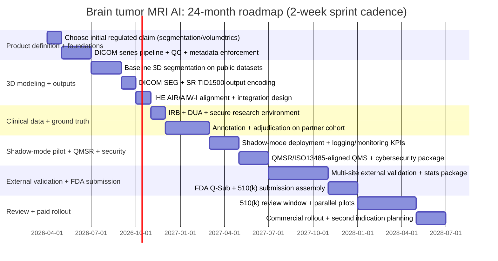

# Roadmap: From Research Prototype to Hospital-Grade Brain Tumor MRI AI Product

**Executive summary.** You have a strong prototype for demos (2D slice-level classifier + explainability + constrained multimodal LLM report drafts + human-in-the-loop UI). The fastest path to a hospital-usable, FDA-clearable product is not to “polish the classifier,” but to **pivot the regulated core** toward what hospitals actually buy in neuro-oncology: **DICOM-native 3D segmentation + volumetrics + longitudinal comparison**, with the LLM limited to **templated, grounded narrative from measured outputs**. This aligns with multiple recent FDA-cleared neuro-oncology tools regulated under **21 CFR 892.2050** and product code families like **QIH** (“automated radiological image processing software”).

**Key decisions that unlock speed:**

1. **Choose one initial regulated claim** (recommended: **segmentation + volumetrics for known tumors**, not primary diagnosis)—many predicates, easier to validate and integrate.
2. **Move from JPG/PNG to DICOM + multi-sequence**; encode outputs as **DICOM SEG + DICOM SR TID 1500**; adopt **IHE AI Workflow for Imaging (AIW-I)** and **IHE AI Results (AIR)** to minimize one-off hospital integrations.
3. **Implement governance and monitoring** per the 2026-effective **QMSR** (ISO 13485:2016 incorporated by reference), plus FDA cybersecurity expectations and **PCCP** planning for future updates.

**Realistic 12–24 month plan (small team):**

- **Months 0–6:** DICOM pipeline + 3D segmentation MVP + DICOM outputs + evaluation on public multi-institution datasets.
- **Months 6–12:** IRB + design-partner data pipeline + ground-truthing + shadow-mode deployment + QMSR/QMS + security baseline.
- **Months 12–18:** Multi-site external validation + FDA pre-sub (Q-Sub) + submission-ready documentation and cybersecurity package.
- **Months 18–24:** Submit 510(k), expand pilots, start paid conversions (or parallel design partners during review).

**Position of current prototype:** Keep the 2D classifier and Gemini report drafts as **prototype features**. The go-live product should treat **classification as secondary research feature** and the **LLM as non-regulated OR tightly bounded documentation support**—especially given FDA’s updated Clinical Decision Support guidance (Jan 2026) and FDA cybersecurity guidance updates (Feb 2026).

---

## 1. Research and technical roadmap

### Milestone principles for neuro-oncology AI that sells

Hospitals and clinicians value neuro-oncology AI when it produces **reusable clinical artifacts**:

- **Segmentations and volumes** (baseline + follow-up) that can be inserted into reports and treatment planning discussions.
- **Interoperable AI results** stored and displayed in PACS/reporting systems (not “a separate demo viewer”). Standards-based interoperability is repeatedly cited as necessary to scale radiology AI deployment.

Your current architecture becomes “hospital-grade” when it adds:

1. **DICOM ingestion + de-identification pipeline** (for research), aligned to DICOM confidentiality profiles and/or established trial tooling.
2. **3D model pipeline** (multi-sequence) and **outputs in DICOM SEG and DICOM SR** (TID 1500) measurement report structures.
3. **QA, monitoring, and governance** as required by imaging AI practice parameters and Good ML Practice (human-AI team performance, monitoring, transparency).

### Recommended product target for first FDA-clearable claim

**Start with segmentation + volumetrics for patients with known tumors, not “tumor type classification from a scan.”**

**Why this is the fastest path:**

- FDA-cleared neuro-oncology products commonly state *not intended for primary diagnosis* and require clinician finalization, which simplifies risk and evidence.
- Fits **21 CFR 892.2050** and product code families used by cleared tools like **Neosoma Brain Mets (QIH)**.

---

## 2. Prioritized 12–24 month roadmap (sprints, staffing, costs)

**Assumptions (US, 2026):** Small team (2–6 FTE) plus paid clinical advisors; shadow-mode pilots before any clinical claims; costs are ballpark ranges; hospital integration and annotation variability is high.

### Minimum viable team roles

| Role | Focus |
|------|--------|
| ML/Imaging Lead | 3D segmentation, evaluation, model QA |
| Imaging Systems Engineer | DICOM routing, PACS integration, output encoding |
| Backend/Platform Engineer | Inference services, auth, logging, deployment |
| Product/UX | Radiologist workflow, review screens, feedback capture |
| Part-time Regulatory/QA + Security | QMSR/ISO13485 mapping, risk, cybersecurity package |

### Roadmap table (sprints grouped into phases)

| Phase (time) | Sprint-level deliverables (2-week increments) | Est. staffing (avg FTE) | Ballpark cost (USD) |
|--------------|------------------------------------------------|-------------------------|----------------------|
| **Phase 1 (0–2 mo)** | Sprints 1–2: Choose initial regulated claim (segmentation/volumetrics), target tumor type and sequences. Sprints 3–4: DICOM ingestion POC (Orthanc/dcm4chee lab), convert pipeline from JPG to DICOM series + metadata; patient-level split enforced. | 2–3 | $40k–$150k |
| **Phase 2 (2–4 mo)** | Sprints 5–6: Training-ready 3D dataset pipeline (resampling, optional bias field correction, sequence QC). Sprints 7–8: Baseline 3D U-Net/nnU-Net or MONAI on public datasets; evaluation harness, calibration, error taxonomy. | 3–4 | $80k–$250k |
| **Phase 3 (4–6 mo)** | Sprints 9–10: Generate DICOM SEG + DICOM SR (TID 1500) outputs; export to PACS test environment. Sprints 11–12: Viewer integration strategy (IHE AIR objects, PACS overlays), local acceptance testing plan per imaging AI practice parameter. | 3–5 | $120k–$400k |
| **Phase 4 (6–9 mo)** | Sprints 13–14: IRB + data use agreements with first design partner; de-id pipeline (CTP or equivalent), secure research environment. Sprints 15–18: Annotation protocol, adjudication workflow, start ground-truth labeling on partner data. | 4–6 + clinicians | $250k–$900k (annotation dominates) |
| **Phase 5 (9–12 mo)** | Sprints 19–20: Shadow-mode deployment in partner workflow (no clinical use); measure latency, failure modes, radiologist edit rates. Sprints 21–24: QMSR-aligned QMS buildout; cybersecurity design controls; monitoring dashboards; LLM grounding from measured outputs. | 4–7 | $300k–$1.2M |
| **Phase 6 (12–18 mo)** | Sprints 25–30: Multi-site external validation dataset; statistical analysis plan; finalize performance. Sprints 31–36: FDA Q-Sub + submission package (software docs, risk mgmt, clinical eval, cybersecurity). | 5–8 | $600k–$2.5M |
| **Phase 7 (18–24 mo)** | Sprints 37–48: Submit 510(k); parallel additional pilots; paid conversion package. Expand indications only after first clearance. | 5–10 | $800k–$3.5M |

### Mermaid roadmap timeline (12–24 months)

---

## 3. Dataset strategy and annotation

### Public datasets (months 0–6)

| Use case | Dataset | Notes |
|----------|---------|--------|
| Glioma 3D multi-sequence + segmentations | **RSNA-ASNR-MICCAI BraTS 2021** (TCIA) | T1, T1c, T2, FLAIR + manual annotations |
| Meningioma 3D | **BraTS Pre-operative Meningioma Dataset** | 1,141 cases |
| Glioma + clinical metadata | **UCSF-PDGM** | 501 diffuse gliomas, standardized protocol, segmentations |
| Brain metastases | **BrainMetShare** (156 studies), TCIA longitudinal mets | For future expansion |
| Pituitary | **OpenNeuro pituitary adenoma** (50), pituitary tumor segmentation (136) | Expert-validated segmentations |

### Design-partner annotation plan (months 6–12)

- **Target cohort:** 250–500 studies from 1–2 sites; minimum ~150 “positive” tumor cases for initial tumor type.
- **Annotation unit:** 3D masks in native space + derived volumes; record time-per-case; capture disagreements.
- **Adjudication:** 2 readers + arbitration for disagreements (especially small lesions/borders). Multi-reader adjudication and clear ground-truth rules reduce regulatory risk and align with FDA expectations.

---

## 4. LLM grounding strategies (regulation-compatible)

**Current approach is correct:** Constrain the LLM from ungrounded claims. **Next step:** Ground the LLM entirely on structured evidence.

**Recommended grounding architecture:**

1. **Evidence JSON:** Segmentation-derived measurements (volume, longest diameter, edema volume if available), acquisition context (sequence availability), model confidence, “limits” flags (missing sequences, low QC).
2. **Narrative templates:** LLM fills a constrained structured report (impression + technique + quantitative section) and must cite which evidence fields it used.
3. **No new facts rule:** LLM is not allowed to introduce size/location unless present in Evidence JSON.
4. **Regulatory separation:** Treat the LLM as a separate software function; FDA Jan 2026 CDS guidance clarifies device vs non-device CDS; report-drafting should be designed so an HCP can “independently review the basis” of any output.
5. **Guardrails & monitoring:** Log prompt, evidence payload, output, and clinician edits (for drift and safety).

---

## 5. Regulatory and quality path

### Choosing the initial claim

| Claim option | FDA fit | Evidence burden | Buyer pull | Recommendation |
|--------------|---------|-----------------|------------|----------------|
| Triage-only (CADt) | QAS, time-sensitive | High | Medium for stroke; unclear for tumors | Not first for tumors |
| Tumor type classification (CADx-like) | Could drift to cancer CADx | Very high | Some interest, high risk | Not first claim |
| **Segmentation + volumetrics for known tumors** | **892.2050, QIH** | **Moderate** | **High (RT, longitudinal)** | **Best first claim** |
| AI-assisted report drafting | May be partly non-device CDS | Depends on claims; GenAI scrutiny | Growing | Grounded documentation only, not regulated core |

### Recommended FDA pathway (US)

- **510(k)** for segmentation/volumetrics under **21 CFR 892.2050**, leveraging predicates (e.g. Neosoma Brain Mets, QIH).
- **FY2026 user fee:** Standard 510(k) ~$26,067; small business ~$6,517.
- **MDUFA V:** “Total Time to Decision” goal 112 calendar days (FY2025–FY2027); end-to-end concept-to-clearance often multi-year—run pilots in parallel.

### QMSR / ISO 13485 (effective Feb 2, 2026)

Minimum QMS components for SaMD:

- Design controls (user needs, design inputs/outputs, verification/validation, traceability).
- Risk management integrated into development and change control.
- Complaint handling + CAPA + supplier management (cloud dependencies matter).
- Software lifecycle documentation and release procedures.

### Cybersecurity (FDA guidance updated Feb 2026)

- Section 524B expectations for “cyber devices”; plan security architecture and documentation as part of premarket package.
- **Pilot-ready baseline:** Threat modeling, SBOM, vulnerability management, patch policy; encryption (transit/at rest), RBAC + MFA, audit logging, secure key management; separate PHI environments per tenant (or on-prem option).

### PCCP (AI lifecycle changes)

- FDA finalized PCCP guidance (Aug 2025) for AI-enabled device software—planned updates without resubmitting if pre-specified and validated. Build release strategy around this early.

### Compliance checklist for first hospital pilots (US)

- **HIPAA:** Administrative, physical, technical safeguards (HHS summary).
- **BAA:** You and cloud providers able to sign (e.g. Google Cloud HIPAA/BAA for eligible services).
- **SOC 2:** Common procurement ask (Security, Availability, Processing Integrity, Confidentiality, Privacy).
- Data retention/deletion policy, breach response plan, vendor security questionnaire readiness.

---

## 6. Clinical validation and go/no-go

### Study progression

**Retrospective → shadow-mode → prospective** (aligned with SaMD clinical evaluation):

1. Retrospective technical validation on public datasets + partner retrospective DICOM.
2. External validation on held-out sites (domain shift is real).
3. Shadow-mode prospective: run silently, compare to clinical standard, measure workflow and reliability.
4. Prospective clinical study only if intended use requires it.

### Metrics (segmentation/volumetrics)

- **Technical:** Dice (DSC) for tumor components; surface distance; volume error (absolute/relative); sensitivity for multi-lesion; failure rate and “no result” rate.
- **Clinical usability:** Time saved per case; radiologist edit distance; report completeness and measurement consistency.

### Go/no-go (example targets; refine with advisors)

- DSC ≥ 0.85 on primary tumor region for common-size lesions; report stratified by lesion size.
- ≤5–10% median relative volume error for key regions.
- <2–5% inference failure rate in shadow deployment (excluding QC-flagged data quality failures).

### Sample size (practical)

- Development: thousands of studies (public + partner) if possible.
- Locked test set: 200–500 studies per major cohort, multi-site.
- At least one truly independent external site.
- **Reporting:** STARD-AI, CONSORT-AI/SPIRIT-AI, CLAIM as appropriate.

---

## 7. Product and integration requirements

### Integration architecture

- **DICOM routing** (push/pull), PACS integration, results as standard objects.
- **Reporting:** RIS templates, SR objects, or measurements as structured data.
- **Standards:** **IHE AI Workflow for Imaging (AIW-I)** (inference request/management/monitoring; DICOM UPS-RS); **IHE AI Results (AIR)** (storage/retrieval/display); **DICOM SEG** (masks), **DICOM SR TID 1500** (measurements, tracking IDs); DICOM confidentiality for de-id.

### Deployment

- **Cloud with BAA** (common) or **on-prem/edge** for data locality.
- **Auth, tenant isolation, audit logs, data retention** mandatory.
- **Latency:** &lt;5–10 minutes per case for segmentation workflows (RT planning can tolerate longer).

### Logging and explainability

- Log: model version, inference time, input sequences, QC flags, outputs; how measurements were computed; clinician edits.
- Explainability UI: emphasize **measurable artifacts** (segmentation + measurement); saliency can remain a development/debug tool.

---

## 8. Go-to-market and pilot plan (first 5–10 design partners)

### Who to target first

- **Academic neuroradiology / neuro-oncology** (publication-friendly, IRB pathways).
- **Radiation oncology planning** (direct ROI: contouring + time savings).
- **Teleradiology groups** later (after PACS integration and clearance).

### Outreach

- Present “shadow-mode + workflow metrics” pilots at **SIIM26**, **ASNR26**, Society for Neuro-Oncology, **MICCAI 2026**.

### Pilot offer templates

| Type | Setup | Deliverables |
|------|--------|--------------|
| **A (research, no PHI leaves site)** | Deploy on their research environment or VPC; they provide retrospective DICOM + clinician time | Model performance report + workflow metrics + pipeline artifacts + co-authorship |
| **B (shadow-mode)** | PACS sends copies to inference service; no results in clinical read | Compare outputs to final reports/segmentations; success = reliability, time savings, acceptable error rates |

### KPIs

- **Technical:** Inference success rate, QC failure rates, segmentation accuracy vs ground truth, drift.
- **Clinical workflow:** Minutes saved per case, edit rates, % cases where quantitative section used.
- **Operational:** Integration time, support tickets, time-to-first-value.

### Pricing: pilot → paid

- **Early:** Pilots free or low-cost (data + clinician time is “payment”).
- **After clearance:** Per-site annual license common; pricing must map to **measurable ROI** (time saved) and **integration simplicity** (IHE-compliant outputs).

---

## 9. Risks, mitigations, contingency

| Risk | Mitigation |
|------|------------|
| **Domain shift** (scanner/protocol) | Multi-site data, sequence-level QC, external validation |
| **2D classifier limitations** | Keep as demo/research feature; no clinical claims until 3D volumetric performance |
| **LLM hallucination** | Evidence-only grounding + templated outputs; LLM as documentation support; monitor edits and failures |
| **Undefined intended use** | Lock narrow claim early (segmentation/volumetrics, not diagnosis) |
| **Frequent model updates** | PCCP strategy and controlled update cycles |
| **Cybersecurity gaps** | Follow FDA cybersecurity guidance; maintain premarket documentation |
| **Integration burden** | DICOM SEG/SR + IHE AIW-I/AIR instead of custom formats |
| **Procurement friction** | SOC 2-ready and BAA-ready early |

---

## 10. Appendix

### Prioritized dataset sources (Tier 1)

- BraTS 2021 glioma (TCIA)
- BraTS pre-op meningioma (1,141 cases)
- UCSF-PDGM (501 diffuse gliomas)
- BrainMetShare, TCIA longitudinal mets
- OpenNeuro pituitary adenoma (50), pituitary tumor segmentation (136)

### Annotation protocol (minimum)

- Define sequences required; define labels (single “tumor” vs sub-compartments) and boundary rules.
- Capture: annotator ID, time per case, uncertainty flags.
- Adjudication: 2 readers + arbitration; final mask + disagreement map.
- Encode: DICOM SEG (mask); DICOM SR TID 1500 (volumes, tracking IDs, longitudinal).

### Key sources (linkable)

| # | Source | URL |
|---|--------|-----|
| 1 | FDA PCCP Guidance (Aug 18, 2025) | https://www.fda.gov/regulatory-information/search-fda-guidance-documents/marketing-submission-recommendations-predetermined-change-control-plan-artificial-intelligence |
| 2 | FDA CDS Guidance (Jan 29, 2026) | https://www.fda.gov/regulatory-information/search-fda-guidance-documents/clinical-decision-support-software |
| 3 | FDA Cybersecurity Premarket (Feb 3, 2026) | https://www.fda.gov/regulatory-information/search-fda-guidance-documents/cybersecurity-medical-devices-quality-management-system-considerations-and-content-premarket |
| 4 | FDA QMSR (effective Feb 2, 2026) | https://www.fda.gov/medical-devices/postmarket-requirements-devices/quality-management-system-regulation-qmsr |
| 5 | FDA MDUFA FY2026 fees | https://www.fda.gov/industry/fda-user-fee-programs/medical-device-user-fee-amendments-mdufa-fees |
| 6 | ACR-SIIM Imaging AI Practice Parameter | https://gravitas.acr.org/PPTS/DownloadPreviewDocument?DocId=217 |
| 7 | IHE AI Workflow for Imaging (AIW-I) | https://www.ihe.net/uploadedFiles/Documents/Radiology/IHE_RAD_Suppl_AIW-I.pdf |
| 8 | IHE AI Results (AIR) Rev 1.3 Aug 2025 | https://www.ihe.net/uploadedFiles/Documents/Radiology/IHE_RAD_Suppl_AIR.pdf |
| 9 | BraTS 2021 (TCIA) | https://www.cancerimagingarchive.net/analysis-result/rsna-asnr-miccai-brats-2021/ |
| 10 | BraTS Pre-op Meningioma (Sci Data 2024) | https://www.nature.com/articles/s41597-024-03350-9 |
| 11 | UCSF-PDGM (TCIA) | https://www.cancerimagingarchive.net/collection/ucsf-pdgm/ |
| 12 | BrainMetShare | https://aimi.stanford.edu/datasets/brainmetshare |
| 13 | Pituitary tumor segmentation (Sci Data 2025) | https://www.nature.com/articles/s41597-024-04218-8 |
| 14 | **Merlin: 3D CT vision-language foundation model** (PMC, 2024; peer-reviewed in *Nature*) | https://pmc.ncbi.nlm.nih.gov/articles/PMC11230513/ |

### Related work: 3D vision-language models

**Merlin** (Blankemeier et al., [PMC11230513](https://pmc.ncbi.nlm.nih.gov/articles/PMC11230513/)) is a 3D vision-language foundation model for **abdominal CT** (not brain MRI), but it is directly relevant to our roadmap:

- **3D + VLM:** Trained on paired 3D CT volumes, EHR diagnosis codes, and radiology reports (no extra manual labels). Processes the full 3D volume at once (I3D ResNet152, clinical Longformer for long reports).
- **Tasks:** Zero-shot findings classification, phenotype classification, cross-modal retrieval, 5-year disease prediction, **radiology report generation**, and **3D semantic segmentation** (20 organs) after adaptation. Demonstrates that one foundation model can support both classification/retrieval and report generation + segmentation.
- **Single-GPU training:** Trained on a single 48GB GPU (A6000), with gradient checkpointing and FP16—relevant for teams with limited compute.
- **Data scaling laws:** Reports power-law relationships between pretraining data size and zero-shot/retrieval performance; useful when planning data needs for brain MRI.
- **Takeaway for us:** When we add 3D brain MRI and report generation, Merlin’s design (EHR + reports as supervision, report splitting by anatomy, multi-task vs staged training, adapter + LLM for report generation) is a strong reference. Our current stack is 2D classification + external LLM (Gemini); the roadmap’s “LLM grounded to measured outputs” and eventual 3D segmentation align with this direction.

**Our architecture stays brain MRI only.** We do not change the project’s architecture (or Figma diagram) to reflect CT or abdomen—Merlin is referenced only as related work and a design reference for a *future* 3D/VLM path.

**Is a “Merlin-like” model for brain MRI possible?** Yes. The same paradigm can be applied to brain MRI: (1) Paired 3D brain MRI (e.g. T1, T1c, T2, FLAIR) + EHR codes + neuro/radiology reports as supervision. (2) One 3D vision encoder (e.g. I3D or 3D ResNet) + text encoder; contrastive and classification losses. (3) Downstream tasks: zero-shot findings, tumor classification, cross-modal retrieval, **brain tumor segmentation**, and **neuro report generation** with an adapter + LLM. (4) Single-GPU or small-cluster training with gradient checkpointing. The main differences from Merlin are modality (MRI not CT), anatomy (brain not abdomen), sequences (multi-contrast brain MRI), and brain-specific tasks (e.g. BraTS-style segmentation, tumor types). Our current architecture and docs remain focused on brain MRI; a “brain MRI Merlin” would be an optional future direction after the 24-month roadmap’s 3D segmentation and report pipeline are in place.

A **brain MRI foundation model pipeline** diagram (data → preprocessing → 3D image + text encoders → contrastive + EHR training → downstream tasks) is in the repo as [docs/assets/brain_mri_foundation_model_pipeline.svg](assets/brain_mri_foundation_model_pipeline.svg). It describes this *future* Merlin-like path only; the *current* product architecture is in `docs/figma-architecture-prompt.md`.

---

*This roadmap is the authoritative 24-month plan from research prototype to hospital-grade, FDA-clearable product. Align `docs/workflows-and-features.md` §9 (to-do) and `docs/startup-gap-analysis.md` with the phases above.*
